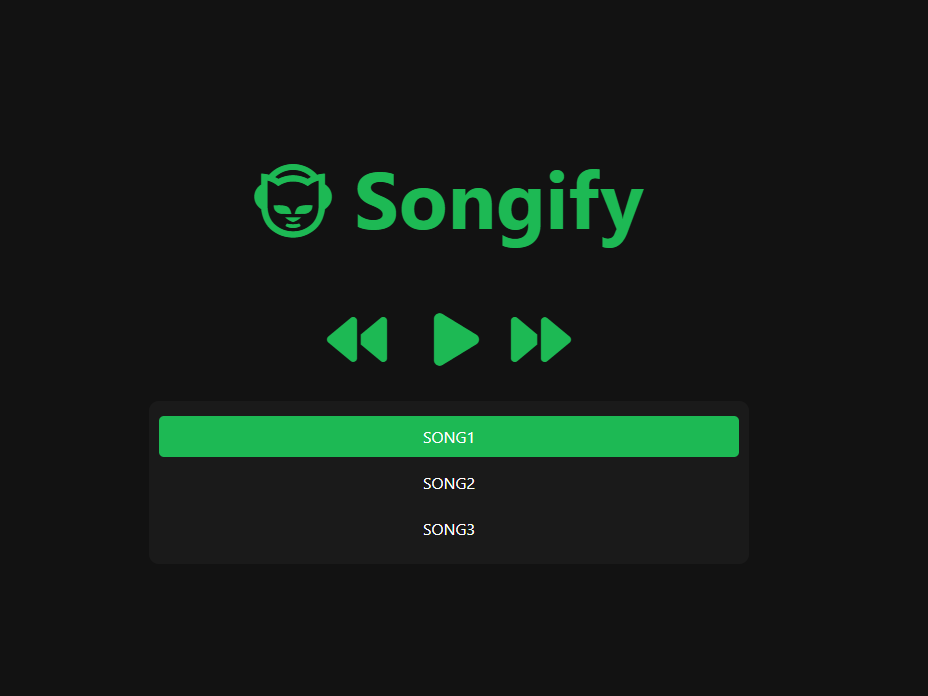

# songify

This project is a simple webpage template for an audio player with dynamic track list.  

### Limitations 

- As is, this project only has support for mp3 audio files, though other file types could likely be enabled with minimal code changes.
- The dynamic track list and deployment features/suggestions here assume some basic comfort around bash and AWS. 
- The bash stuff here was only tested in WSL2 + Ubuntu 22.04.3 LTS. 

### Usage (quickstart)

For the easiest quickstart to see this project in action:

1. Clone this repository. 
2. Add your mp3 files to the `songs/` directory. 
3. Update the `songs.json` file with your track names (file names minus the `.mp3` extension). 
4. Launch a simple web server and view in a browser.  `python3 -m http.server` 
5. Note, CORS policy will prevent your pages from loading correctly if you just try to open your local files in a browser. 

### Usage (dynamic track list)

This project incudes some simple bash scripting to automate the generation of the `songs.json` based on the contents of your `songs/` directory.  Requires `bash` (obviously) and `jq`.  

1. Clone this repository. 
2. Add your mp3 files to the `songs/` directory. 
3. Update the `songs.json` file with your track names (file names minus the `.mp3` extension). 
4. Edit the `build.env` file, adding your values for `WEB_ROOT_DIR` (the full directory path above your website directory) and `SITE_NAME` (the name of your website / base directory).  Note, if you are not deploying anything / don't have an actual domain, you can just have your site name be `SITE_NAME=songify` to match the name of this cloned directory.  

        export WEB_ROOT_DIR="/mnt/c/www"
        export SITE_NAME="www.myawesomewebsite.com"

5. Source the `build-functions.sh` file, and use the `generate_songs_json` function to generate the `songs.json` file based on the contents of your `songs/` directory.  

        . build-functions.sh
        generate_songs_json

6. If all went well, you should have a `songs.json` reflecting the mp3 files under the `songs/` directory. 

        you@LOCAL:/mnt/c/www/songify $ ls -A songs/*.mp3
        songs/song1.mp3  songs/song2.mp3  songs/song3.mp3
        you@LOCAL:/mnt/c/www/songify $
        you@LOCAL:/mnt/c/www/songify $ cat songs.json
        {
        "songs": [
            "song1",
            "song2",
            "song3"
        ]
        }

7. As a result, your site should automatically render the new track list based on this `songs.json` content.  

### Deployment / Hosting Suggestion (AWS S3)

AWS S3 is a good (and cheap) choice for hosting a static website like this.  If you have AWS CLI installed with authentication configured, you can use the `deploy` function in `build-functions.sh` to build and deploy everything to an AWS S3 bucket of your choice.  If you want to get extra fancy, purchase a new domain and leverage AWS CloudFront + AWS Certificate Manager for SSL.  

1. Create a new bucket on AWS S3: `www.myawesomewebplayer.com` 
2. Rename your website directory to reflect: `mv songify/ www.myawesomewebplayer.com/`
3. Change to your `www.myawesomewebplayer.com/` directory, and use the `deploy` function to generate your songs.json and sync everything to AWS S3. 

        cd www.myawesomewebplayer.com/
        . build-functions.sh 
        deploy 
